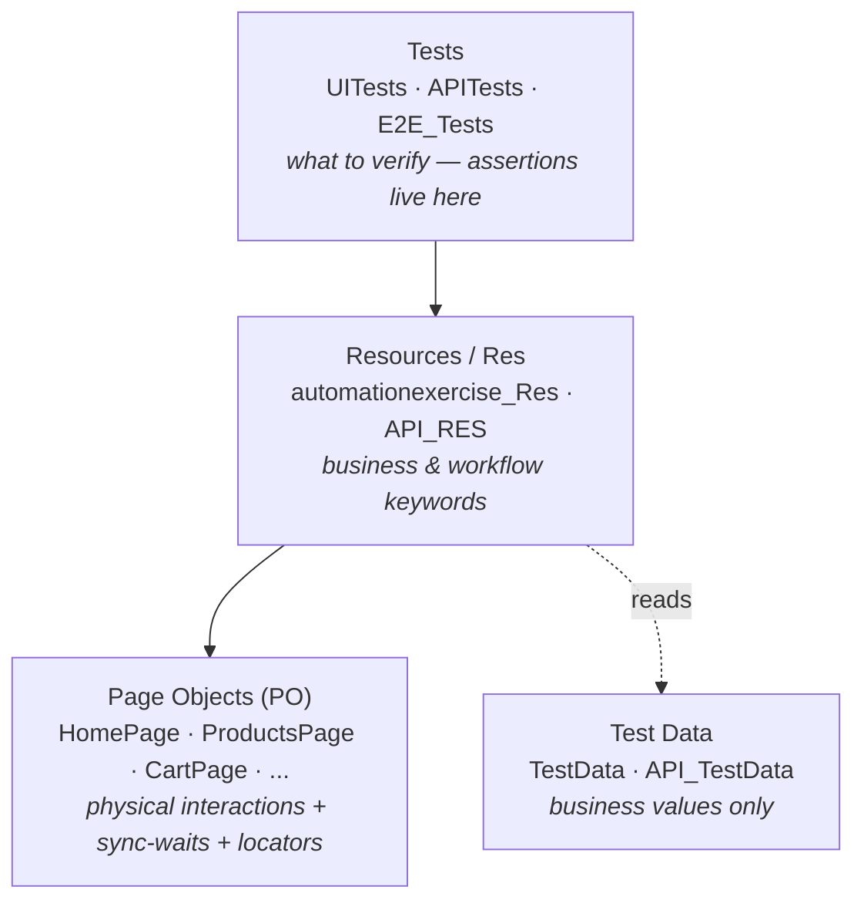
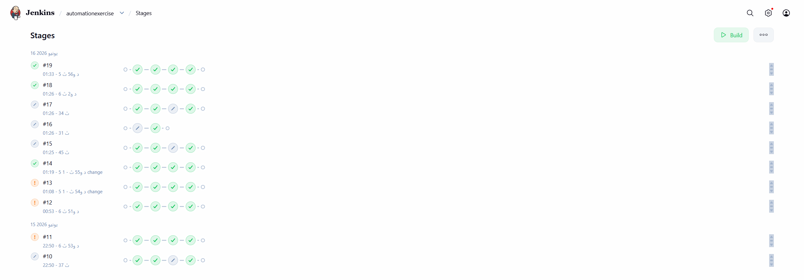
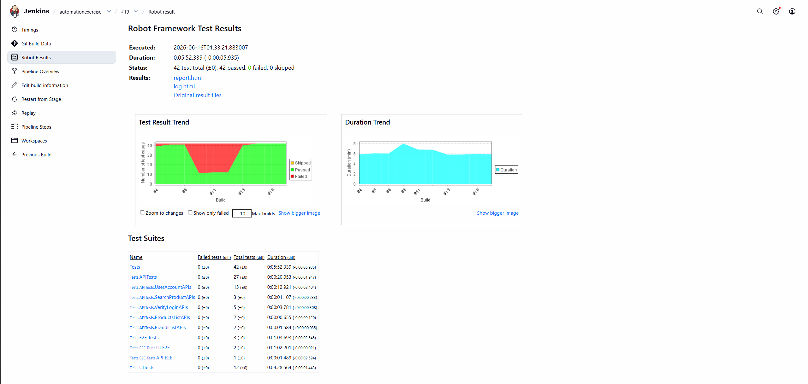

# Automation Exercise — Robot Framework Test Suite

End-to-end **UI and API** test automation for [automationexercise.com](https://automationexercise.com), built with Robot Framework on a strict three-layer architecture (Tests → Resources → Page Objects).

[](https://tahafaisal00.github.io/automationexercise/)


**Live report:** an interactive [Allure test report](https://tahafaisal00.github.io/automationexercise/) is published to GitHub Pages — open it to browse the full run with no setup.

---

## Overview

This suite tests a live e-commerce demo site across two interfaces — the browser UI and the public REST API — plus full end-to-end user journeys that span both. It covers positive flows, negative flows, and **bug-documenting tests** that capture known defects in the target site without breaking the build.

The point of the repo is not just coverage. It's the architecture: every locator, every wait, and every business assertion has exactly one place it is allowed to live, enforced consistently across ~20 files.

---

## Tech stack

| Concern              | Tool                          |
| -------------------- | ----------------------------- |
| Test framework       | Robot Framework 7.4           |
| Language runtime     | Python 3.14                   |
| UI automation        | SeleniumLibrary               |
| API automation       | RequestsLibrary               |
| Test data generation | FakerLibrary                  |
| Built-ins            | Collections, String           |

---

## Architecture

A three-layer design with one rule per layer. Responsibilities never leak across boundaries.



**The rules that hold the suite together:**

- **Sync-waits vs. business assertions never mix.** A sync-wait inside a Page Object proves an action *landed* (the page is ready). A business assertion in the test layer proves a *requirement* was met. They are different jobs and live in different layers.
- **Locators and paths live inside Page Objects.** Business values live in test data files. A locator never appears in a test; a hard-coded business value never appears in a Page Object.
- **No single-call pass-through wrappers** in the Resource layer — a keyword earns its place by doing real composition.
- **Dictionaries are unpacked at the Resource boundary** and never enter a Page Object.

---

## Project structure

```
automationexercise/
├── Resources/
│   ├── Common.robot                 # Browser setup, test isolation, teardown
│   ├── TestData.robot               # UI business values
│   ├── API_TestData.robot           # API business values + BASE_URL
│   ├── automationexercise_Res.robot # UI workflow / business keywords
│   ├── API_RES.robot                # API workflow / business keywords
│   └── PO/                          # Page Objects: interactions, sync-waits, locators
│       ├── HomePage.robot
│       ├── Signup_LoginPage.robot
│       ├── ProductsPage.robot
│       ├── CartPage.robot
│       ├── CheckoutPage.robot
│       └── PaymentPage.robot
└── Tests/
    ├── UITests.robot                # UI functional + bug-documenting tests
    ├── APITests/                    # API tests grouped by resource
    │   ├── BrandsListAPIs.robot
    │   ├── ProductsListAPIs.robot
    │   ├── SearchProductAPIs.robot
    │   ├── UserAccountAPIs.robot
    │   └── VerifyLoginAPIs.robot
    └── E2E_Tests/
        ├── UI_E2E.robot             # Full browser purchase journeys
        └── API_E2E.robot            # Full account lifecycle over the API
```

---

## Test coverage

**UI (`Tests/UITests.robot`)**
Login/logout, registration and account deletion, invalid-credential login, product review, cart deletion, search by name, search with invalid input, and category/brand filtering. Includes bug-documenting tests for the cart quantity field (non-editable field, negative quantities, negative price).

**API (`Tests/APITests/`)** — grouped by resource:
Brands List, Products List, Search Product, User Account, and Verify Login. Each file covers positive paths and negative paths (wrong HTTP method, missing fields, invalid credentials).

**End-to-end (`Tests/E2E_Tests/`)** — journeys that exercise the full stack:
- `Registered User Completes Purchase` — login through checkout and payment.
- `Guest Converts To Registered And Purchases` — guest checkout that converts to a registered account mid-flow.
- `Full Account Lifecycle - Create Login Delete Then Login Fails` — pure-API lifecycle asserting that a deleted account can no longer authenticate.

---

## Tagging strategy

Tests are tagged on four axes so any slice can be run on demand:

- **Layer** — `ui`, `api`, `e2e`
- **Type** — `functional`, `bug`
- **Expectation** — `positive`, `negative`
- **Resource / method** (API) — `useraccounts`, `brandslist`, `productslist`, `searchproducts`, `verifylogin`, plus `get` / `post` / `put` / `delete`

```bash
robot --include api AND positive Tests/        # only happy-path API tests
robot --exclude bug Tests/                      # skip known-defect tests
robot --include useraccounts Tests/APITests/    # everything touching the account resource
```

---

## Bug-documenting tests

Some tests deliberately assert the target site's **actual broken behavior** rather than the correct behavior, tagged `bug` with an inline comment stating *expected vs. actual*. This keeps CI green while still pinning the defect: if the site is ever fixed, the test fails loudly and tells you the bug is gone. It is a record of known issues, not a source of false failures.

---

## Running the suite

**Prerequisites:** Python 3.14 and Google Chrome.


---

## CI/CD

The full 42-test suite runs in a Jenkins declarative pipeline (`Jenkinsfile`): checkout → dependency install → headless execution → Robot Framework result publishing.

**Pipeline stages**


**Latest run — 42/42 passing, with trend and per-suite breakdown**


```bash
# 1. Install dependencies
pip install robotframework robotframework-seleniumlibrary robotframework-requests robotframework-faker

# 2. Run everything
robot Tests/

# 3. Run a single suite
robot Tests/UITests.robot
robot Tests/APITests/
robot Tests/E2E_Tests/

# 4. Run headless (for CI)
robot --variable HEADLESS:True Tests/
```

Results are written to `output.xml`, `log.html`, and `report.html` in the working directory.
